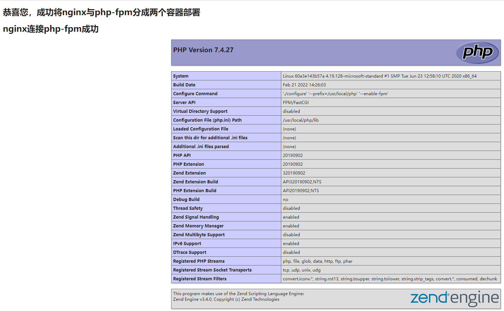

### 0 下载|构建镜像

如果嫌麻烦，可以直接从远程仓库下载已经打包好的[nginx镜像](https://hub.docker.com/repository/docker/crazyjums/nginx)和[php-fpm镜像](https://hub.docker.com/repository/docker/crazyjums/php-fpm)：
```bash
$ docker pull crazyjums/nginx # 下载nginx镜像
$ docker pull crazyjums/php-fpm  # 下载php-fpm镜像
```

可以根据`Dockerfile`定制化镜像，然后自己手动打包:
```bash
$ cd docker_dnmp
$ cd nginx
$ docker build -t <image_name> .  ## 记得把这里的<image_name>需要与docker-compose.yml的image配置项中的镜像名保持一致
$ cd ..
$ cd php
$ docker build -t <image_name> .  ## 记得把这里的<image_name>需要与docker-compose.yml的image配置项中的镜像名保持一致
```
等待几分钟，镜像就打包好了，然后在通过`docker-compose`来管理镜像即可。

### 1 开启服务

```bash
$ docker-compose up <service_name>
$ docker-compose up <service_name> -d  ##以守护进程的方式运行
```

举例，这里以开启`nginx`和`php-fpm`服务为例：

```bash
$ docker-compose up nginx php-fpm
```

开启之后使用`docker ps`查看已经启动的容器，然后再浏览器访问[http://localhost:892](http://localhost:892)，出现以下界面表示配置成功：


### 2 关闭或重启服务

```bash
$ docker ps  ##查看服务的container id
$ docker restart <service_container_id>  ##重启服务
$ docker stop <service_container_id>  ##停止服务
$ docker start <service_container_id>  ##开启服务
```

举例：

以`redis`为例：

```bash
$ docker ps  ##查看redis服务的container id
CONTAINER ID   IMAGE     COMMAND                  CREATED          STATUS          PORTS                    NAMES
54f64de09cd9   redis     "docker-entrypoint.s…"   38 seconds ago   Up 35 seconds   0.0.0.0:6380->6379/tcp   dnmp-redis-1

$docker stop 5  ##停止redis服务   container id可以简写，只要能区分就行
$docker start 5 ##开启redis服务
```

